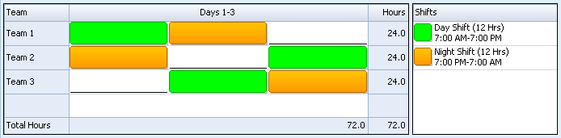

The Point 85 Shift library project manages work schedules.  A work schedule consists of one or more teams who rotate through a sequence of shift and off-shift periods of time.  The Shift project allows breaks during shifts to be defined as well as non-working periods of time (e.g. holidays and scheduled maintenance periods) that are applicable to the entire work schedule.  The Java library is used in the Point 85 OEE project that can be found here.  The Shift library is also available in C# here and in Python here.

This diagram illustrates Business Management Systems' DNO (Day, Night, Off) work schedule with three teams and two 12-hour shifts with a 3-day rotation.  This schedule is explained in here.

<h3>Shift</h3>

A shift is defined with a name, description, starting time of day and duration.  An off-shift period is associated with a shift.  In the example above for Team1, there are two shifts followed by one off-shift period.  Shifts can be overlapped (typically when a handoff of duties is important such as in the nursing profession).  A rotation is a sequence of shifts and off-shift days.  The DNO rotation is Day on, Night on and Night off.  An instance of a shift has a starting date and time of day and has an associated shift definition.
​
<h3>Team</h3>
A team is defined with a name and description.  It has a rotation with a starting date.  The starting date shift will have an instance with that date and a starting time of day as defined by the shift.  The same rotation can be shared between more than one team, but with different starting times.
​
<h3>Work Schedule</h3>

A work schedule is defined with a name and description.  It has one or more teams.  Zero or more non-working periods can be defined.  A non-working period has a defined starting date and time of day and duration.  For example, the New Year's Day holiday starting at midnight for 24 hours, or three consecutive days for preventive maintenance of manufacturing equipment starting at the end of the night shift. 
After a work schedule is defined, the working time for all shifts can be computed for a defined time interval.  For example, this duration of time is the maximum available productive time as an input to the calculation of the utilization of equipment in a metric known as the Overall Equipment Effectiveness (OEE).
​
<h3>Rotation</h3>

A rotation is a sequence of working periods (segments).  Each segment starts with a shift and specifies the number of days on-shift and off-shift.  A work schedule can have more than one rotation.
​
<h3>Non-Working Period</h3>

A non-working period is a duration of time where no teams are working.  For example, a holiday or a period of time when a plant is shutdown for preventative maintenance.  A non-working period starts at a defined day and time of day and continues for the specified duration of time.
​
<h3>Shift Instance</h3>

A shift instance is the duration of time from a specified date and time of day and continues for the duration of the associated shift.  A team works this shift instance.

<a href="index.html">Return to top</a>

---
